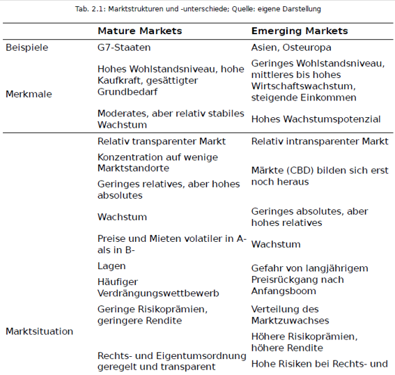

class: title-slide

```{r xaringan-themer, include=FALSE}
library(xaringanthemer)
style_xaringan(text_color = "#232461",inverse_text_color = "#FFFFFF",inverse_background_color = "#232461", title_slide_background_color = "#232461",header_background_color = "#232461",header_color = "#FFFFFF",header_h1_font_size = "32px",
  header_h2_font_size = "26px",link_color="#d84116",
  header_h3_font_size = "20px",text_slide_number_color = "#232461",text_slide_number_font_size = "0.5em")
```

```{r xaringanExtra, echo=FALSE}
xaringanExtra::use_progress_bar(color = "#d84116", location = "bottom")
xaringanExtra::use_xaringan_extra(c("tile_view","scribble","panelset","tachyons"))
xaringanExtra::style_panelset_tabs(font_family = "inherit")
#xaringanExtra::use_search(show_icon = TRUE)
#weitere: "share_again","animate_css", "webcam","freezeframe","clipboard","fit_screen","extra-styles" 
xaringanExtra::use_editable(expires = 1)
xaringanExtra::use_freezeframe(trigger = "hover")
```


```{r setup, include=FALSE}
options(htmltools.dir.version = FALSE)
library(fontawesome)
```


# Internationale Immobilienmärkte


## Intake 2020B

### Globalisierung und Institutionenökonomischer Ansatz


<br>
<br>
<br>
<br>
<br>
<br>
<br>
<br>
### Sommersemester 2023 
<br>
### Prof. Dr. Jörg Schoder
.mycontacts[
`r fa('github')` @ISBA-University
`r fa('linkedin')` @jfschoder
]


---
layout: true

<div class="my-footer"></div>       

<div style="position: absolute;left:400px;bottom:10px;color:ISBAblue;font-size:9px">`r r2symbols::sym('copyright')``r rmarkdown::metadata$author`</div>


---
name: agenda
class: inverse, center, middle

# Das Programm


.blockquote[Teil 1: Globalisierung in der Immobilienwirtschaft]

.blockquote[Teil 2: Institutionenökonomischer Ansatz]


---
name: Teil1
class: inverse, center, middle

## Teil 1

##  Globalisierung in der Immobilienwirtschaft

.blockquote[Globalisierungsbegriff]

.blockquote[Immobiliendienstleistungen]

.blockquote[Immobilieninvestments]


---
name: glob
class: left

# Globalisierung

.panelset[
.panel[.panel-name[Einordnung]
* Lokale Märkte als räumlich beschränkte kleinteilige Gebiete werden zunehmend vernetzt:
  * traditionell geringer Austausch mit externen Märkten (autarke Märkte)
  * Zunahme des externen Austauschs von Waren und Dienstleistungen (zunächst v.a. regional und national)

* Globalisierung als dynamischer und multidimensionaler Prozess der wirtschaftlichen Integration, betrifft verschiedenste Bereiche menschlichen Handelns
]
.panel[.panel-name[Rahmenbedingungen]
Globalisierung **in Wellen** bereits seit dem 19. Jahrhundert
Meist wird der Begriff jedoch verwendet, um die Entwicklungen seit den 1980er Jahren zu beschreiben, die maßgeblich die folgenden Ursachen haben:
* Liberalisierung/Deregulierung 
    * Abbau tarifärer und nichttarifärer
  Handelshemmnisse/Marktzugangsbarrieren weltweit (GATT seit 1948 bzw. ab 1995 WTO) und Bildung kontinentaler Wirtschaftsblöcke (EU, NAFTA, etc.)
    * Deregulierung Finanzmärkte (Bsp. Kapitalverkehrskontrollen)
    * Deregulierungen auf nationaler Ebene ("Standortwettbewerb")
    
* Technologischer Fortschritt (v.a. IKT)

`r fa('circle-right')` Interaktion Politik und Marktkräfte
`r fa('circle-right')` Höhepunkt Finanzkrise 2008 (?)

]
]


???

* `r fa('circle-right')` Vor allem Informations- und Kommunikationstechnologie (Bedeutung für Steuerung und Kontrolle multinationaler Unternehmen/Wertschöpfung)

* GB BigBang 1986 – freier Kapitalverkehr revolutioniert britischen Finanzsektor – Bedeutungsgewinn Finanzplatz London

---
name: Immo-Glob
class: left 

# Globalisierung der Immobilienmärkte

.panelset[
.panel[.panel-name[Besonderheit]
* Standortgebundenheit
* Motive für Direkte (Marktnähe, Synergien, Kosten) vs. Indirekte Investments (Diversifikation)
* Nebeneinander lokaler und internationaler Akteure

`r fa('circle-right')` Seit Mitte der 1990er Jahre zunehmende Professionalisierung

]
.panel[.panel-name[Bereiche]
```{r glob1,echo=FALSE,out.width='100%',fig.align='center',cache=TRUE}

```
.quellePan[Quelle: Vornholz (2015, S. 42).]
]
.panel[.panel-name[Ausprägungen]
```{r glob2,echo=FALSE,out.width='100%',fig.align='center',cache=TRUE}

```
<br>
.quellePan[Quelle: Vornholz (2015, S. 42).]
]
]

???

* Realwirtschaftlich: Standortgebundenheit `r fa('circle-right')` indirekte Effekte:
    * Zerlegung der Wertschöpfungskette und Produktionsverlagerungen induzieren lokale Nachfrage nach Produktionsstätten
    * Einkommenssteigerungen bewirken Nachfragesteigerung für Wohnimmobilien und Einzelhandelsflächen

---
name: Immo-DL
class: left

# Exkurs: Immobilien-Dienstleistungen

.panelset[
.panel[.panel-name[Tätigkeitsbereiche]
```{r ImmoDL,echo=FALSE,out.width='100%',fig.align='center',cache=TRUE}

```
.quellePan[Quelle: Vornholz (2015, S. 4).]
]
.panel[.panel-name[Motive]
* Immobiliendienstleister folgen z. B. ihren Auftraggebern bei deren Expansion ins Ausland
* Zentraler Mehrwert für Auftraggeber: lokale Expertise und erhöhte Markttransparenz (Research) `r fa('circle-right')` Senkung von Informationskosten
* Marktnähe durch global-lokalen Arrangements: von losen Kooperationen über Projektnetzwerke und Joint Ventures bis hin zu Kapitalbeteiligungen und Fusionen
* Unterschiedliches Ausmaß der Internationalisierung: Projektentwicklung vs. Makler
]
]

???

* Fließender Übergang von lokalen zu internationalen Tätigkeiten:
  * Ausländische Investoren kaufen/verkaufen Immobilien, Immo-Portfolios und Immo-Unternehmen in D. Bspw. Wohnimmobilien als Zweitwohnsitze (Italiener in Berlin), Gewerbeimmobilien als Kapitalanlage
  * Projektentwicklung durch ausländische Gesellschaften/Bauunternehmen (öffentliche Vergaberegeln!)
  * Ausländische Unternehmen als Mieter
  * Ausländische Akteure kaufen/verkaufen immobilienbezogene Güter und DL (global sourcing)

* Anwaltskanzleien und internationale Standardisierungen (Anglo-Amerikanisierung von Verträgen)

* Projektentwickler und Architekten (Bsp. Fußballstadien Südafrika/Brasilien, Elbphilharmonie)

* **Nutzung**
* Facility-Service-Unternehmen und global sourcing (Auslandsumsatz deutscher Unt. bei 20%, Median: 5%, Maximum (Dussmann, Bilfinger): 45 bzw. 33% 
`r fa('circle-right')` unterschiedliche Organisationsformen: Eigenständige Leistungserbringung (20%), Kooperation mit ausl. Partner (15%), Netzwerke (10%); 1/3 der Unt. ohne Auslandsstrategie 

* Auslandskontrollierte Unternehmen:
  * im Baugewerbe: 683 Unt. (2011)  `r fa('circle-right')`2,5% aller auslandskontr. Unt. bzw. 0,3% aller Branchenunt.
  * im Grundstücks- und Wohnungswesen: 3093 Unt. (2011) `r fa('circle-right')`11,2% aller auslandskontr. Unt. bzw. 1,3% aller Branchenunt
  * Umsatz: 9,4 Mrd. Euro bzw. 10% am gesamten Branchenumsatz 


---
name: Immo-Invest
class: left

# Immobilien-Investmentmärkte

.panelset[
.panel[.panel-name[Entwicklung]
```{r vol,echo=FALSE,out.width='100%',fig.align='center',cache=TRUE}

```
.quellePanURL[Quelle: [Vornholz (2023)](https://link.springer.com/chapter/10.1007/978-3-658-36554-7_3).]
]
.panel[.panel-name[Aktuell]
```{r vol-aktuell,echo=FALSE,out.width='100%',fig.align='center',cache=TRUE}
knitr::include_graphics('../images/session_IRE/Vol_aktuell_(JLL).png')
```
.quellePanURL[Quelle: [JLL (2023)](https://www.jll.de/content/dam/jll-com/documents/pdf/research/emea/germany/de/Investmentmarktueberblick-JLL-Deutschland.pdf).]
]
.panel[.panel-name[Top Deal]
```{r TopDeal,echo=FALSE,out.width='80%',fig.align='center',cache=TRUE}
knitr::include_graphics('../images/session_IRE/TopDeal_2022_(private-banking-magazin.de).png')
```
<br>

.quellePanURL[Quelle: [private-banking-magazin.de (2023)](https://www.private-banking-magazin.de/top-10-einzeltransaktionen-immobilien-deutschland-top-7-standorte/?page=10#pagebrowser-bildstrecke).]
]

]

???


* Top Deal 2022: Platz 1: Marienturm (Frankfurt) – Kaufpreis: >800 Millionen Euro
  * Frankfurter Bankenviertel: mehr als 45.000 Quadratmeter Bürofläche, die sich auf 38 Stockwerke verteilt.
  * Käufer: DWS für den südkoreanische Rentenfonds National Pension Service of Korea
  * Verkäufer: Aermont Capital/Perella Weinberg Partners


---
name: fdi
class: left

# Ausländische Investoren

.panelset[
.panel[.panel-name[Entwicklung]
```{r fdi,echo=FALSE,out.width='100%',fig.align='center',cache=TRUE}

```
.quellePanURL[Quelle: Vornholz (2015, S. 5).]
]
.panel[.panel-name[Aktuell]
```{r fdi-aktuell,echo=FALSE,out.width='100%',fig.align='center',cache=TRUE}
knitr::include_graphics('../images/session_IRE/Invest_Auslaender_(JLL_2023_S6).png')
```
.quellePanURL[Quelle: [JLL (2023, S. 6)](https://www.jll.de/content/dam/jll-com/documents/pdf/research/emea/germany/de/Investmentmarktueberblick-JLL-Deutschland.pdf).]
]
]

???

* zunehmende Internationalisierung der Investmentmärkte erst seit 2000 (vgl. Investitionsvolumen)


---
name: GlobalCities
class: left

# Exkurs: Global Cities

.panelset[
.panel[.panel-name[Definitionen]
* Friedmann (1986):
  * Wichtiges Finanzzentrum
  * Headquarters transnationaler Unternehmen
  * Internationale Institutionen
  * Dominante Stellung des DL-Sektors
  * Bevölkerung
* Sassen (2001):
  * Steuerungszentralen transnationaler Unternehmen
  * Finanzdienstleistungen als dominanter DL-Zweig
  * FIRE
  * Orte der Produktion
  * Orte der Innovation
  * unternehmensbezogene DL
* GaWC Group (seit 1998): zunächst dominante Ausrichtung an Finanz-DL, Anwaltskanzleien, Buchhaltung, Werbung, Marketing
]
.panel[.panel-name[GaWC 2020]
```{r GaWC,echo=FALSE,out.width='100%',fig.align='center',cache=TRUE}
knitr::include_url('../images/session_IRE/GaWC_2020.jpg',height='480px')
```

.quellePanURL[Quelle: [GaWC (2020).](https://www.lboro.ac.uk/microsites/geography/gawc/world2020t.html)]
]
]


---
name: Attraktiv
class: left

# Immobilien als Assetklasse

* Realbesicherung und Möglichkeit zu gehebelten Investments

* Marktineffizienzen aktivem Investment-Ansatz

* Umschichtung finanzieller Mittel gemäß Portfoliotheorie

  * Einfluss von Zinsunterschieden zwischen Assets/Asset-Klassen (Empirie: nicht allein entscheidend!)
  * Erwartungen über Immobilienpreis-Entwicklung
  * Erwartungen über Inflation (bzw. Stabilität Währungssystem)
Steuerliche Abschreibungsmöglichkeiten

* Interdependenz zwischen Immobilien- und Kapitalmärkten nimmt mit steigender Bedeutung indirekter Immobilienanlagen zu 

* Besonders hohe Korrelation im downturn [(vgl. Schindler/Liow, 2017)](https://www.emerald.com/insight/content/doi/10.1108/JPIF-02-2016-0010/full/html)

???

* Geldsystem ist letztlich mit Immobilien gedeckt

* Schindler/Liow
Ergebnisse Schindler/Liow (2012) zum Verhältnis von Aktienmarkt und (öffentlich gelisteten) Immobilienmarktprodukten (Public Real Estate Markets)
Zeitliche Schwankungen der Korrelationen zwischen den beiden Märkten auf nationaler regionaler und globaler Ebene
Integrationsniveau der Märkte insgesamt „eher moderat“, auf nationaler Ebene stärkster Zusammenhang im Asiatisch-Pazifischen Raum
USA/Europa: Zusammenhang zwischen Aktien- und verbrieftem Immobilienmarkt am stärksten auf der regionalen Ebene
Korrelationen zwischen Aktien- und verbrieftem Immobilienmarkt nehmen in Marktphasen mit hoher Volatilität zu
Zeitliche Abhängigkeiten im Sinne kausaler Zusammenhänge (lead/lag) wenig ausgeprägt (und bei Betrachtung vor/nach Finanzkrise instabil)
Integration der verbrieften Immobilienmärkte nimmt langfristig gegenüber den regionalen und globalen Aktienmärkten leicht zu, 
Integration mit den nationalen Aktienmärkten nimmt eher abnimmt


---
name: OIFretlet
class: left

# Offene Immobilienfonds


.panelset[
.panel[.panel-name[Durchschnittswerte]
```{r OIFretlet,echo=FALSE,out.width='100%',fig.align='center',cache=TRUE}

```

.quellePanURL[Eigene Darstellung. Datenquelle: [Scope (2023)](https://www.scopegroup.com/dam/jcr:b461c4db-421f-4ebd-bead-e3668875f5c9/Scope%20Renditekennzahlen%20Offene%20Immobilienfonds%20Mai%202023.pdf).]
]
.panel[.panel-name[Verteilung]
```{r OIFretdis,echo=FALSE,out.width='100%',fig.align='center',cache=TRUE}

```
.quellePanURL[Eigene Darstellung. Datenquelle: [Scope (2023)](https://www.scopegroup.com/dam/jcr:5d0634bc-c9a8-4307-a34a-582c0c682747/Scope%20Markanalyse%20Offene%20Immobilienfonds%20M%C3%A4rz%202023.pdf).]
]
]


---
name: CREfunds
class: left

# Zunehmende Bedeutung von Investmentfonds...

...in den europäischen Immobilieninvestmentmärkten.

.panelset[
.panel[.panel-name[Zunahme...]
...des Anteils von Immobilien-Investmentfonds in Gewerbeimmobilienmärkten der Eurozone. Angaben in %:
```{r reiftime,echo=FALSE,out.width='100%',fig.align='center',cache=TRUE}
knitr::include_graphics('../images/session_IRE/Anteile_Investmentfonds_in_CRE_Europe_(EZB).png')
```

.quellePanURL[Quelle: [EZB (2023)](https://www.ecb.europa.eu/pub/financial-stability/macroprudential-bulletin/html/ecb.mpbu202304_1~4a07638376.en.html).]
]
.panel[.panel-name[Varianz...]
...im Ländervergleich (in % der nationalen Gewerbeimmobilienmärkte)
```{r reifnat,echo=FALSE,out.width='100%',fig.align='center',cache=TRUE}
knitr::include_graphics('../images/session_IRE/Anteile_Investmentfonds_in_CRE_countries_(EZB).png')
```
.quellePanURL[Quelle: [EZB (2023)](https://www.ecb.europa.eu/pub/financial-stability/macroprudential-bulletin/html/ecb.mpbu202304_1~4a07638376.en.html).]
]
]


---
name: Finanzialisierung
class: left

# Folgen der Internationalisierung

* Interdependenzen zwischen nationalen Immobilienmärkten (Bsp. US-Subprime-Krise)

* Substitution von In- und Auslandsinvestitionen

* Übertragung von Standards und Unternehmerischen Praktiken
  * Managementideen und Strategien (Buy and Manage, Sale and leaseback…)
  * Internationale Rechnungslegung (IFRS)
  * Finanzprodukte (Bsp. REITs)
  
* Zunehmende Markttransparenz durch Professionalisierung und Research

* Verfügbarkeit neuer Produkte (v.a. indirekte Anlagen wie REITs)

???

* Die Folgen der Globalisierung zeigen sich
sowohl in **quantitativen** als auch **qualitativen** Veränderung der Immobilienmärkte.

* Quantitativ: Marktteilnehmer, Produkte

* Qualitativ: zunehmenden Professionalisierung und Markttransparenz

* Quantitative und qualitative Veränderungen sind insbesondere bei 
  * der Intensität,
  * der geografischen Ausdehnung und 
  * der Beschleunigung der grenzüberschreitenden Aktivitäten festzustellen. 
  
* So hat die Zahl der Staaten und Märkte, die im Fokus der Investoren stehen, in den vergangenen Jahren nach der Finanz- und Wirtschaftskrise wieder deutlich zugenommen


---
name: Teil2
class: inverse, center, middle

## Teil 2

##  Institutionenökonomischer Ansatz

.blockquote[Staatliche Rahmenbedingungen]

.blockquote[Gesamtwirtschaftliche Rahmenbedingungen]

.blockquote[Demografische und gesellschaftliche Rahmenbedingungen]


---
name: overview
class: left

# Insitutionenökonomischer Ansatz


.panelset[
.panel[.panel-name[Grundidee]
* Herausbildung unterschiedlicher Marktergebnisse durch Zusammenspiel der vielfältigen Institutionen (formelle und informelle Regeln)
* Akteure handeln in Systemen sozialer und wirtschaftlicher Strukturen, die sich laufend verändern
]
.panel[.panel-name[Faktoren]
* Mikroökonomische Faktoren (Besonderheit der Immobilie als Wirtschaftsgut)
* Makroökonomische Faktoren
    * Wirtschafts- bzw. Einkommensentwicklung
    * Zinsen, Inflation bzw. Außenwert von Währungen
    * Finanzmärkte und Finanzierungsbedingungen (Kreditzugang etc.)
    * Konjunkturzyklus vs. Immobilienzyklus

* Staat
  * Indirekter Einfluss über politischen und rechtlichen Rahmen
  * Direkter Einfluss über Interventionen

* Demographie und gesellschaftliche Trends
]
]

???

* Zyklizität der Immobilienmärkte (Schweinezyklus und Time-to-build)

* Realwirtschaft (Produktion von Gütern und DLen):
  * Indirekter Einfluss auf Immobilienmarkt über Investmentmärkte
  * Direkter Einfluss auf Immobilienmarkt über Vermietungsmarkt
* Finanzmarkt (Geld, Devisen und Kapital):
  * Wird vom Immobilienmarkt beeinflusst (Anlagealternativen)
  * Bereitstellung von Liquidität sowie über monetäre Größen (Inflation, Zinsen, Wechselkurse) beeinflusst:
      * Vermietungsmarkt indirekt
      * Investmentmarkt direkt
Obs! Staat hat auf diese Größen direkten (Bsp. Kreditvergabestandards) und/oder indirekten Einfluss


---
name: IMarkt
class: left

# Ein Markt wie jeder andere

.panelset[
.panel[.panel-name[Angebotsseite]
* Verfügbarkeit Bauland und Aspekte der Raumplanung/Stadtplanung

* Mietrecht

* Steuerliche Behandlung

* Sozialer Wohnungsbau

* Bestand vs. Neubau

* **Kapitalmärkte**

]
.panel[.panel-name[Nachfrageseite]
* Raumstruktur (Monozentristisch vs. Polyzentristisch)

* Wirtschaftskraft/Einkommen

* Wirtschaftsstruktur (Agrar-/Industrie-/Dienstleistungssektor)

* Haushaltszusammensetzung/-größe

* **Kapitalmärkte**

]
]

???

* Besonderheiten des Wirtschaftsguts Immobilie
  * Standortgebundenheit (Immobilität)
  * Einzigartigkeit `r fa('circle-right')` Heterogenität
  * Losgröße und Marktliquidität `r fa('circle-right')` Intransparenz begünstigt Marktineffizienzen

* Außerdem: Konsumgut (Nutzung) und Investitionsgut (Eigentümer)


* Zwischenfazit: Heterogenität und Marktineffizienz


---
name: Kapmarkt
class: left

# Immobilien- und Kapitalmärkte

.panelset[
.panel[.panel-name[Interdependenz]
```{r ImmoKap,echo=FALSE,out.width='100%',fig.align='center',cache=TRUE}
knitr::include_graphics('../images/session_IRE/Immo_Kapmarkt_(Brauer_2013_S21).png')
```
<br>
.quellePanURL[Quelle: Brauer (2013, S. 21).]
]
.panel[.panel-name[DiPasquale/Wheaton (1992)]
```{r DiPasqualeWheaton,echo=FALSE,out.width='70%',fig.align='center',cache=TRUE}

```
.quellePanURL[Quelle: DiPasquale/Wheaton (1992, S. 188).]
]
]


???

* DiPasquale/Wheaton
  * Langfristiges Gleichgewicht! Modell nicht geeignet um kurzfristige Marktdynamiken zu beschreiben! 
  
* NW-Quadrant: höhe der Rendite – hier gegeben.  Höhere Renditeerwartungen am Kapitalmarkt = Drehung der Geraden im Uhrzeigersinn
Gegeben die erzielbare Miete im NE-Quadrant, kann im NW der angemessene Marktpreis der Immobilie abgelesen werden

* SW:  f(C) = replacement costs/construction costs als Function der Bautätigkeit C.
	 hier: Fixkosten und steigende Grenzkosten. gegeben den Marktpreis aus * NW kann die Neubautätigkeit bestimmt werden
	 
 	ebenfalls denkbar: Konstante Kosten unabhängig von Bautätigkeit = Vertikale Gerade
    	oder alternativ: inealistisches Angebot (zB. Aufgrund Bodenknappheit oder Bottlenecks): horizontale Linie

* SE: langfristiges Immobilienangebot: Bestandsänderung DeltaS= Neubau minus Abschreibung

	hier: Neubau hält Stock konstant deltaS=0 bzw. S=C/d

* NE: nimmt Bautätigkeit und fragt: Wenn diese ewig anhält, welcher Stock resultiert dann langfristig?

---
name: Zyklen
class: left

# Immobilieninvestments und -zyklen

* Wirtschaftlicher Konjunkturzyklus hat Effekte auf Immobilienmarkt (Interaktion makroökonomischer Größen und „Time to build“)
* Immobilienmärkte besonders anfällig für spekulative, sich selbst verstärkende Effekte 
* Immobilienzyklus als zeitlicher Wechsel von Überangebot und Übernachfrage am Immobilienmarkt:
  * Projektentwicklungen
  * Neubauten
  * Bauvolumina
  * Miet- und Investmentmärkte
* Global Cities besonders betroffen


???

* Immobilien (direkte oder indirekte Anlage) geeignet zur Diversifizierung professionell gemanagter Vermögensportfolios 
* Zu beachten: Ausgeprägte Zyklen
  * Cobweb-Theorie/Schweinezyklen und Time-to-build
  * Globalisierung des Bankwesens und lokale Immobilienmärkte
  * Ökonomisches Verständnis unabdingbar für gute/informierte Investment-Entscheidungen


---
name: Finanzierung
clasS: left

# Finanzierung im internationalen Vergleich


```{r ,echo=FALSE,out.width='100%',fig.align='center',cache=TRUE}
knitr::include_graphics('../images/session_IRE/Finanzierung_International_(IMF_2015)_S10.png')
```
.quelle[Quelle: [IMF (2015, S. 10).](https://www.imf.org/external/pubs/ft/sdn/2015/sdn1512.pdf)]


---
name: Marktstrukturen
class: left

# Märkte und Marktstrukturen

.panelset[
.panel[.panel-name[Reifegrad]
```{r ,echo=FALSE,out.width='100%',fig.align='center',cache=TRUE}

```
.quellePanURL[Quelle: Vornholz (2015, S. 12).]

]
.panel[.panel-name[Strukturen]
```{r ,echo=FALSE,out.width='65%',fig.align='center',cache=TRUE}

```
.quellePanURL[Quelle: Vornholz (2015, S. 13).]
]
.panel[.panel-name[Strukturen (cont'd)]
```{r ,echo=FALSE,out.width='70%',fig.align='center',cache=TRUE}

```

<br>
.quellePanURL[Quelle: Vornholz (2015, S. 12).]

]
]


---
name: Institutionen
class: left

# Institutionen

* Informelle Regeln
  * Kulturelle Gepflogenheiten (Bsp. Smalltalk)
  * Sprache
  `r fa('circle-right')` interkulturelle Kompetenz

* Formelle Rahmenbedingungen
  * Politik (Bürokratie, Korruption)
  * Rechtssystem (v.a. Eigentumsrechte, Mietrecht, Baurecht)
  * Marktinformationen (Verlässlichkeit Statistik) und Markttransparenz (`r fa('circle-right')` GRETI)

???

unterschiedliche Verhandlungstempo kann der Grund dafür sein. In
vielen Ländern ist Small Talk ganz wichtig, um Vertrauen herzustellen.
In China, Japan, Indien, den arabischen Ländern sind derartige
Gespräche für die Geschäftsanbahnung essenziell. Manche
Geschäftspartner reagieren darauf aber ungeduldig und empfinden
das als Zeitverschwendung.
Darüber hinaus können Sprachdefizite den Austausch erschweren.
Einige Kulturen wie die Spanier sind nachsichtig, wenn der neue
Partner oder Kollege ein wenig radebrecht. Chinesen sind eher peinlich
berührt, wenn sich ihr Gegenüber in Kantonesisch versucht.
Pünktlichkeit wird ebenfalls in den verschiedenen Kulturen
differenziert betrachtet. In China ist Pünktlichkeit eine Tugend, bereits
eine Verspätung von wenigen Minuten wird als unhöflich empfunden.
In Deutschland und der Schweiz ist Unpünktlichkeit eine Beleidigung
des Gastgebers. In anderen Kulturen wird entspannter mit der Zeit
umgegangen. Im Mittelmeerraum, in arabischen Ländern und in
Lateinamerika ist es normal oder wird es zumindest weitgehend
toleriert, wenn die Gäste etwa eine halbe Stunde zu spät bei einer
Einladung zum Abendessen erscheinen.
In einigen asiatischen Ländern und in Mittelamerika ist es üblich,
direkt nach dem Essen aufzubrechen. Diejenigen, die nicht gleich
gehen, weisen so darauf hin, dass sie noch nicht genug gegessen
haben. Wer dagegen in Indien, Nordamerika oder Mitteleuropa gleich
geht, erscheint unhöflich. Dort bedeutet dieses Verhalten, dass es dem
Gast nur ums Essen ging, nicht aber um die Gesellschaft mit den
Gastgebern.
Viel reden (USA, arabischer Sprachraum) steht der Wortkargheit bis
hin zum Schweigen in Japan gegenüber, wo dem Schweigen zwischen
den Wörtern entscheidende, sogar in den Worten entgegengesetztem
Sinn, Bedeutung zukommt. Langes Schweigen wird dort durchaus als
behaglich empfunden, während dies in Indien, Europa und
Nordamerika bald zu Unsicherheit und Verlegenheit führt.
Augenkontakt zu vermeiden oder auf den Boden zu schauen, während
mit einer höhergestellten Person gesprochen wird, ist in Afrika ein
Zeichen von Respekt. Im Gegensatz dazu gilt dieselbe Handlung in
Nordamerika und dem größten Teil Europas als Signal von
unangemessener Scheu oder Unehrlichkeit.


---
name: Transparenz
class: left

# Global Real Estate Transparency Index

.panelset[
.panel[.panel-name[GRETI]
<iframe width="1000" height="480" src="https://www.youtube.com/embed/moCSZpUqYdI" title="YouTube video player" frameborder="0" allow="accelerometer; autoplay; clipboard-write; encrypted-media; gyroscope; picture-in-picture; web-share" allowfullscreen></iframe>
]
.panel[.panel-name[Methodik]
```{r GRETI,echo=FALSE,out.width='100%',fig.align='center',cache=TRUE}
knitr::include_url('../images/session_IRE/GRETI_Methodik_(JLL_2023).png',height = '480px')
```

.quellePanURL[Quelle: [JLL (2023, S. 14).](http://www.jll.com/GRETI)]
]
.panel[.panel-name[Aktuell]
```{r GRETI-2023,echo=FALSE,out.width='100%',fig.align='center',cache=TRUE}
knitr::include_url('../images/session_IRE/GRETI_2022.png',height = '480px')
```

.quellePanURL[Quelle: [JLL (2023, S. 4).](http://www.jll.com/GRETI)]
]
]


---
name: RisikenEM
class: left

# Exkurs: Risiken in Emerging Markets

Cushman&Wakefield (2014):
* Transparenz-Risiko (Rechtssicherheit)
* Geo-politisches Risiko (Konflikte, polit. Stabilität)
* Korruptions-Risiko (Corporate Governance)
* Sicherheits-Risiko (Terror, Naturkatastrophen)


---
name: staat
class: left

# Die Rolle des Staates

.panelset[
.panel[.panel-name[Zuständigkeiten]
* Rechtlicher Rahmen 
  * Allgemein: Grundvoraussetzung für stabile Wirtschaftsordnung (Ordnungspolitik, Rechtssicherheit)
  * Speziell: Mietrecht, Raumordnung/Stadtplanung (engl. Zoning), Finanzierungswesen
* Steuern, Subventionen (Miete vs. Eigentum)
* Wohnungspolitik (Objekt- vs. Subjektförderung)
]
.panel[.panel-name[Wirtschaftspolitik]
```{r ,echo=FALSE,out.width='80%',fig.align='center',cache=TRUE}

```

]
]

???

Ausgestaltung von Hypotheken, Zugang Kapitalmärkte, Existenz Bausparkassen etc.

---
name: Wohnungspolitik
class: left

# Wohnungspolitik

```{r ,echo=FALSE,out.width='100%',fig.align='center',cache=TRUE}
knitr::include_graphics('../images/session_IRE/Wohnungspolitik_(Harsman_Quigley_1991_S22).png')
```

.quelle[Quelle: Harsman/Quigley (1991, S. 22).]


---
name: Demografie
class: left

# Demografie

* Absolute Bevölkerungsentwicklung
* Bevölkerungsstruktur (struktureller demogr. Wandel)
* Migration (Binnen- und Außenwanderung)
* Urbanisierung
* Lebensstile und Haushaltsgröße 

---
name: EndHanks
class: center

background-size: 75%
background-image: url(https://media.giphy.com/media/KJ1f5iTl4Oo7u/giphy.gif)

