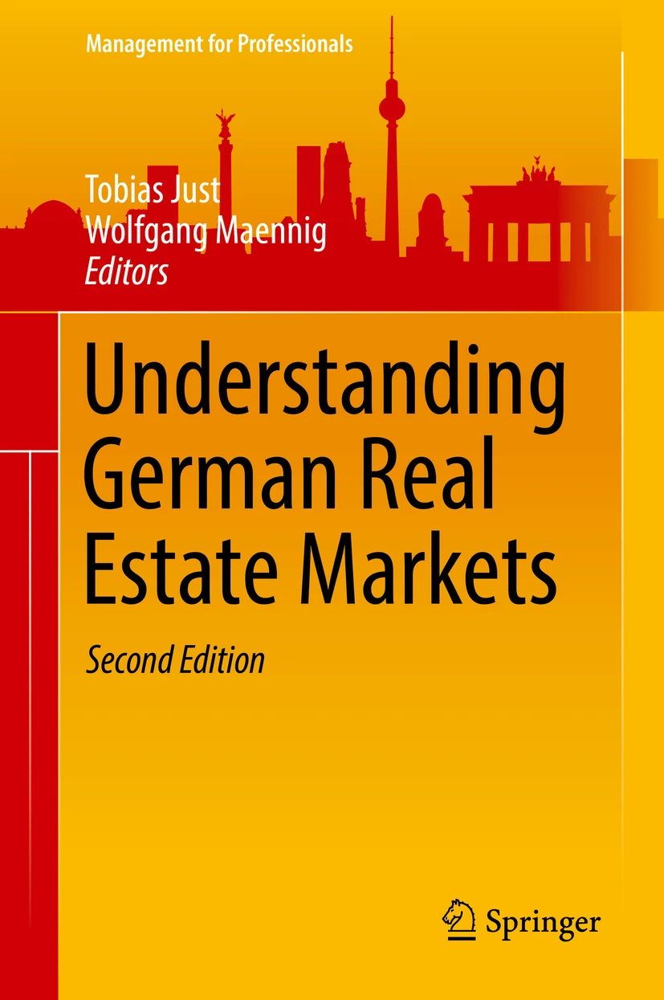
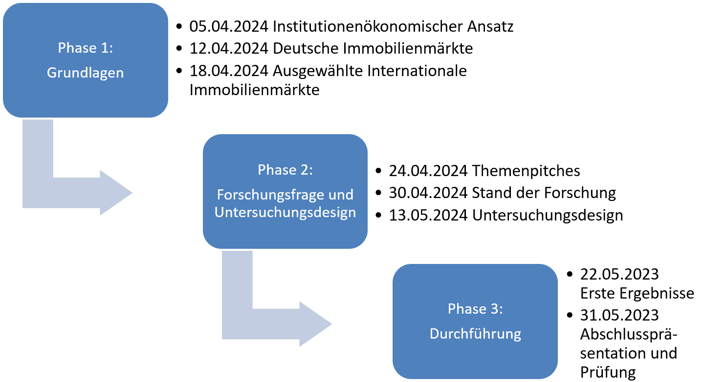

class: title-slide

```{r xaringan-themer, include=FALSE}
library(xaringanthemer)
style_xaringan(text_color = "#232461",inverse_text_color = "#FFFFFF",inverse_background_color = "#232461", title_slide_background_color = "#232461",header_background_color = "#232461",header_color = "#FFFFFF",header_h1_font_size = "32px",
  header_h2_font_size = "26px",link_color="#d84116",
  header_h3_font_size = "20px",text_slide_number_color = "#232461",text_slide_number_font_size = "0.5em")
```

```{r xaringanExtra, echo=FALSE}
xaringanExtra::use_progress_bar(color = "#d84116", location = "bottom")
xaringanExtra::use_xaringan_extra(c("tile_view","scribble","panelset","tachyons"))
xaringanExtra::style_panelset_tabs(font_family = "inherit")
#xaringanExtra::use_search(show_icon = TRUE)
#weitere: "share_again","animate_css", "webcam","freezeframe","clipboard","fit_screen","extra-styles" 
xaringanExtra::use_editable(expires = 1)
xaringanExtra::use_freezeframe(trigger = "hover")
```

```{r setup, include=FALSE}
options(htmltools.dir.version = FALSE)
library(latex2exp)
library(fontawesome)
```

# Internationale Immobilienmärkte

## Intake 2021 A

### Organisatorisches


<br>
<br>
<br>
<br>
<br>
<br>
<br>
<br>
### Sommersemester 2024
<br>
### Prof. Dr. Jörg Schoder
.mycontacts[
`r fa('github')` @ISBA-University
`r fa('linkedin')` @jfschoder
]


---
layout: true

<div class="my-footer"></div>       

<div style="position: absolute;left:400px;bottom:10px;color:ISBAblue;font-size:9px">`r r2symbols::sym('copyright')``r rmarkdown::metadata$author`</div>


---
name: intro
class: left

# Intro

<iframe width="1000" height="520" src="https://www.youtube.com/embed/sSOkdUqmQqo" title="YouTube video player" frameborder="0" allow="accelerometer; autoplay; clipboard-write; encrypted-media; gyroscope; picture-in-picture; web-share" allowfullscreen></iframe>

.quelle[Weitere Infos: [JLL Global Real Estate Perspective May 2023](https://www.jll.de/en/trends-and-insights/research/global/gmp).]

---
name: Orga
class: inverse, center

<br>
<br>

## Organisatorisches

.blockquote[Kontaktdaten]

.blockquote[Lernziele]

.blockquote[Workload und Prüfungsleistungen]


---
name: kontakt
class: left

# Kontakt
<br>
<br>
.blockquote[.center[
.bold[Prof. Dr. Jörg Schoder]
<br>
<br>
Studienbereichsleiter
<br>
Immobilienwirtschaft,
Sportmanagement
<br>
<br>
Raum A 102
<br>
`r fa("phone")` +49 761 - 791 999-87
<br>
`r fa("envelope")` [j.schoder@isba-freiburg.de](j.schoder@isba-freiburg.de)
<br>
<br>
Sprechstunde: nach Vereinbarung
]
]


<br>
`r fa("linkedin")`[jfschoder](https://www.linkedin.com/in/jfschoder/) ? Gerne! Nach Abschluss des Studiums.


---
name: orga1
class: left

# Lernziele Teilmodul "Internationale Immobilienmärkte"

* .bold[Inhaltliche Kompetenzen]:
    * Verständnis der Immobilienwirtschaft als Querschnittsdisziplin
    * Analyse aktueller Branchen- und Marktentwicklungen unter verschiedenen Perspektiven (mikro- und makroökonomisch, unter Investitions- und Finanzierungsaspekte, Marketing-Implikationen etc.)
    * Vergleich nationaler und internationaler Entwicklungen (Einfluss staatlicher Politik, (steuer-) rechtlicher Rahmenbedingungen sowie soziodemografischer Entwicklungen)

--

* .bold[Methodenkompetenzen]:
  * Analyse von Marktentwicklungen im Rahmen eines institutionenökonomischen Ansatzes
  * Einordnung von Marktentwicklungen und Ableitung von strategischen Handlungsalternativen (unternehmerische Entscheidungskompetenz)


--

* .bold[Fachübergreifende Kompetenzen]:
  * Zusammenhang gesamtwirtschaftlicher Entwicklungen und Immobilienmarkttrends
  * Bedeutung gesellschaftlicher und technologischer Entwicklungen für unternehmerische Entscheidungen und Geschäftsmodelle


---
name: orga2
class: left

# Workload und Prüfungsleistung

* Modul: Spezielle Themen und Trends in der Immobilienwirtschaft
  * Teilmodul: Immobilienmärkte
  * Teilmodul: Aktuelle Themen und Trends in der Immobilienwirtschaft 

* Leistungspunkte: 1 ECTS je Teilmodul

* Workload:
  * Je 10 Stunden Präsenzunterricht 
  * Je 20 Stunden Selbststudium (Literatur, Recherchen und Präsentationen)
  
* Prüfungsleistung: kombinierte Prüfungsleistung:
  * Präsentationen (laufend)
  * Fachgespräch (Semesterende)

---
name: PA
class: left

# Projekt-Beispiel

.pull-left[
```{r, echo=FALSE,fig.align='center',out.width="95%"}

```
]
.pull-right[
```{r, echo=FALSE,fig.align='center',out.width="95%"}

```
]
.quelle[Bildquelle: [Springer Nature](https://media.springernature.com).]


???

Ergänzend: Diverse Gutachten, Artikel und Arbeitspapiere


---
name: Lit
class: left

# Literatur

.blockquote[
"A book about global property investment is rare, and a good one is, frankly, **difficult** to write. **Which countries** should be referred to? Can we **extrapolate** from the small number of markets we are familiar with? If so, how much **generalization** is reasonable, fair or justified? How big is the language barrier? Are the **same concepts** familiar to real estate investors in all markets, even though they may have **different labels**?" .tr[
— .small[[Baum/Hartzell 2012, S. x](https://onlinelibrary.wiley.com/doi/book/10.1002/9781444347289)]
]
]


---
name: lit
class: left

# Ausgewählte Literatur

## Bücher

.blockquote[
[Vornholz, G. (2015)](https://www.degruyter.com/document/doi/10.1515/9783110437829/html?lang=de): Internationale Immobilienökonomie. Globalisierung der Immobilienmärkte. De Gruyter Oldenbourg.
]


.blockquote[
[Seabrooke, W. et al. (2004)](https://www.wiley.com/en-us/International+Real+Estate%3A+An+Institutional+Approach-p-9781405103084): International Real Estate: An Institutional Approach. Wiley-Blackwell.
]

## Berichte und Gutachten

.blockquote[
[Feld, L. et al. (2023)](https://zia-deutschland.de/fruehjahrsgutachten/): Frühjahrsgutachten Immobilienwirtschaft 2023 des Rates der Immobilienweisen. ZIA, Berlin.
]


.blockquote[
[Whitehead, C. et al. (2023)](https://www.lse.ac.uk/geography-and-environment/research/lse-london/documents/Reports/Rapport-Financialization-Samlet-05.06.pdf): Financialization in 13 cities – an international comparative report. The London School of Economics and Political Science in collaboration with the Knowledge Centre for Housing Economics, London, 95 Seiten.
]

.blockquote[
[Geng, N. (2018)](https://www.imf.org/en/Publications/WP/Issues/2018/07/13/Fundamental-Drivers-of-House-Prices-in-Advanced-Economies-46053): Fundamental Drivers of House Prices in Advanced Economies. IMF Working Paper No. 2018/164.
]


???

.blockquote[
[Crowe, C. et al. (2011)](https://www.elibrary.imf.org/view/journals/001/2011/091/article-A001-en.xml): How to Deal with Real Estate Booms: Lessons from Country Experiences. IMF Working Paper No. 2011/91. 
]


---
name: lit2
class: left

# Ausgewählte Literatur (cont'd)

## Artikel

.blockquote[
[Duca, J. et al. (2021)](https://www.aeaweb.org/articles?id=10.1257/jel.20201325): What Drives House Price Cycles? International Experience and Policy Issues. In: Journal of Economic Literature, 59(3). S. 773-864.
]

.blockquote[
[Knoll, K. et al. (2017)](https://www.aeaweb.org/articles?id=10.1257/aer.20150501): No Price Like Home: Global House Prices, 1870-2012. In: American Economic Review, 107 (2). S. 331-353.
]

.blockquote[
[Cerutti, E. et al. (2017)](https://www.sciencedirect.com/science/article/abs/pii/S1051137716300237): Housing finance and real-estate booms: A cross-country perspective. In: Journal of Housing Economics, 38. S. 1-13.
]


.blockquote[
[Guest, R. & N. Rohde (2017)](https://onlinelibrary.wiley.com/doi/abs/10.1111/abac.12110): The Contribution of Foreign Real Estate Investment to Housing Price Growth in Australian Capital Cities. In: ABACUS, 53(3). S. 304-318.
]

.blockquote[
[Fernandez, R. & M. Aalbers (2016)](https://journals.sagepub.com/doi/abs/10.1177/1024529415623916?journalCode=ccha): Financialization and housing: Between globalization and Varieties of Capitalism. In: Competition & Change, 20(2). S. 71-88.
]


---
name: timeline
class: left

# Semesterplanung


```{r, echo=FALSE,fig.align='center',out.width="100%"}

```


